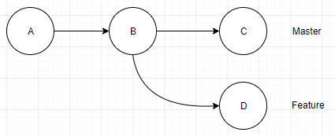
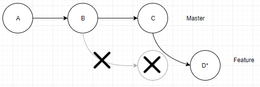
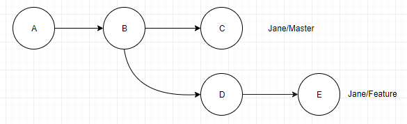
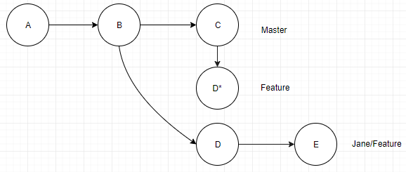
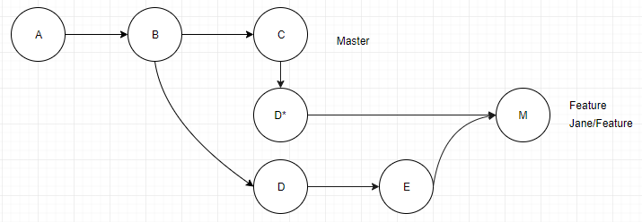
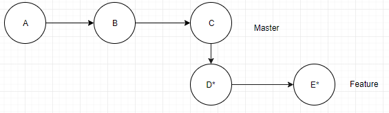
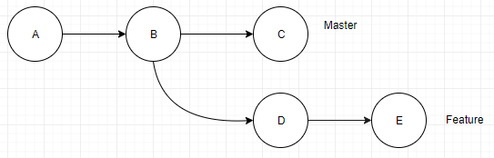
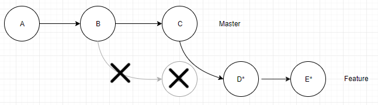
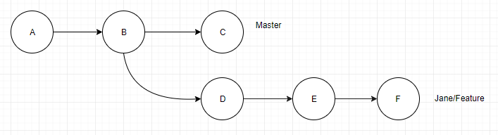
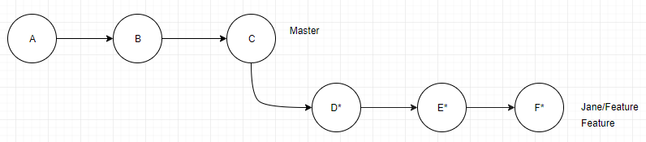

[comment]: <> (Markdown version)

# Managing Git History

#Table of Contents

1. How to Use this Guide
2. Git History Components
3. Rebase
  i. Purpose
  ii. Introduction
  iii. History
  iv. How it works
  v. Experiments
  vi. General Lessons
  vii. Advanced Reading
  viii. Summary/Takeaways
  ix. Rebase Commands
  x.References 
4. Summary
5. Glossary <---Or something

---

##1. How to use this Guide

##2. Git History Components
Before we can get into managing git history, It's important to understand what parts make up that history. Lets start off by disection what is stored in your commit.

**Commits:**
    - Author Data
    - Committer Data
    - Parent Tree
    - Parent Commit

The Author Data contains the authors Name, email, author timestamp and time-zone.

The Committer Data contains the same information but for the user who last applied the commit.

Commits also store the sha-1 of their parent commit. In fact, commits can really only see backwards. This is where Git's HEAD object comes in.

**HEAD:**
One head object is created for every branch within the repository. The Head object contains a pointer to the latest commit within it's branch. This is how git tracks the latest commit.

When either merging, rebasing, or squashing, HEAD is used to check how an operation should proceed. 


Timestamps are the chronological measurements of git history. As we discuss methods to manage our history, understanding how timestamps work and are affected by our commands will help you make better decisions and become more proficient git users.


Every commit has two separate timestamps. The GIT_AUTHOR_DATE, and the GIT_COMMITTER_DATE. 

The author date is when the original commit was created on a local repository. Author date stays consistent, even after a merge or rebase. 

(helpful for seeing project history linearly; as long as view is consistent) 
Commit date is the time the commit was applied to a remote. Merging or rebasing changes this date. 

Author date is the git default date when viewing history, not commit date. However, the default order in a repository’s history is the order they were applied, which is the commit date. When a commit isn’t applied(pushed) shortly after creation, a chronologic distortion may appear.

--insert example here

This distortion can make history difficult to understand. Don’t worry, the real history is still correct and intact, as long as anyone didn’t manually change these dates.

Solutions:

There are two main solutions to this problem.  Solution one is to change how you view the history. If this problem occurs multiple times, you can use git log --pretty=format=”%cd”. %cd designates the commit date. You should be able to verify that the chronological order is still intact. If not, someone has manually changed a timestamp, or used advanced features like rebase -i.

--insert example here

Solution two is that when pushing, all team members use the --ignore-date option. This works by setting the author date to the commit date. In this way, git preserves the chronological order of commits. This isn’t without it’s own problems though; using this command will overwrite the original author date.


NOTE: --ignore-date option does not with with interactive rebase!! See “interactive rebasing”.

Key Points:


Two different dates
1) Author Date: The date the author created the commit.
2) Commit Date: The date anyone applies a commit.

History date defaults to author date.

Applying changes alters commit date, but not author date.

Two main solutions:
1) Manually View commit date in history
2) Use --ignore-date when applying changes (overwrites author date with commit date)


## _I. Purpose_

---

This document is for anyone interested in using git rebase to improving productivity or project history clarity.

This report will answer:

- why rebase is useful
- what git rebase does
- when rebase can be used
- where rebase problems can occur
- how to fix or mitigate rebase problems

---

## _II. Introduction_

---

#### What is Rebase?

Git Rebase is a tool used to integrate changes while sustaining manageable & clean histories.

Git merge is used similarly to git rebase, but they are very different. Although there are inherent risks, rebase manages git histories to be more useful and relevant.

Git merge creates a new commit in the history for the changes merged from one branch into the target branch. If you only merge, your history will soon look like this: 

**[insert pic of messy merge-only history]**

The best use for merge is when you want a set of commits from an old branch to stand out in the overall history, like large refactors or major features.

Git rebase appends your un-merged commits on top of the commit history of the referenced branch.

Git rebase rewrites  git history by taking your commits, stashing them, updating your branch to include all the commits from the referenced branch and then replaying your stashed commits (making new commits identical to the ones that were stashed) on the head of the target branch. This produces a much cleaner history because it doesn’t add that extra commit and keeps the history linear. 


**[insert simple pic of merge vs rebase]**

#### Why rebase?

Opinions on using rebase tend to be varied and extreme due to the inherent risks

There are two main philosophies on keeping a git history:

- _Anti-rebasers_ want a **complete** record of project history, including each contributor's history. They believe git histories should show every bug fix, code redesign, false starts, and unnecessary commits.

- _Pro-rebasers_ want a **relevant** record of project history. They believe history from individual contributors are irrelevant and can be distracting or counter-productive.

Many teams prefer a history in between, so understanding how to rebase safely is important.

People tend to avoid rebase, because misuse can 
- lose work
- lose history
- create confusing history with duplicate commits

Also, timestamps become distorted, which can cause problems with retroactively looking for bugs. Ultimately, the history is more of a relevant picture rather than a complete one. (1)

The alternative is to incorporate rebase in your integration workflow. Some teams only use rebase, while other teams choose to rebase for a subset of scenarios. When rebase is used appropriately, developers can still commit often, [bisect](https://linuxhint.com/git-bisect-tutorial/) for bugs, all while avoiding lots of merge commits to the entire project history.

Rebasing is more than a tool for “_cleaning a commit history._” It is powerful when properly incorporated into a team’s regular [workflow](https://www.atlassian.com/git/tutorials/comparing-workflows).

---

## _III. How It Works_

---

In this section we will take a look at git rebase, what it does to project history, and when it can be used.

##### What really happens

For now, consider the simple case of syncing changes between master and a feature branch.

In this example we want to update our current working branch (feature branch) with changes added to the referenced branch (master). 

```
(In your console)
~/Git/GitExample (feature) <--This is the branch being rebased (1)
$ git rebase master <-- We are rebasing onto Master (2)
```

The diagram below shows what happens when you are _rebasing feature onto master_ (`$ git rebase master`).

To convince yourself, notice how feature has a "new base" on top of "where master is."


Source: freecodecamp.org

Suppose you are working on the feature branch and your team has finalized additions to master. Rebasing will put your changes on top of master’s new commits. You can get newer, finalized additions or bug fixes in your work, without creating extra merge commits.

Note master branch is unchanged here. When we rebase feature, only feature is changed.

When you decide you want master to incorperate the feature branch, and you rebased feature onto master's new changes, merging with master will result in a _fast-forward merge._

 The terminology is that we "rebase feature onto master".

This does not mean to modify the master branch. This means to 'peel' your changes off your branch and 'stash' them for later re-use, then update the "base" of your branch to the "head" of the master branch, then 'replay' your changes ontop of the new head of your branch. 

After a rebase the "base" of your feature branch will be identical to the "head" of the master branch - as if you originally pulled your branch from that "head" commit.  Essentially you have given your branch a new 'base' – you have 're-based' your branch to the head of the master branch. 

Once this succeeds you can then merge your branch back to master and have a clean - linear - history.


##### What actually happens during a rebase?

1. The differing commits from feature are stored in the stash
2. Copies of these commits are played on top of master. The copies represent the same changes, but have a different parent commit, and therefore have a different SHA1 ref
3. Feature branch’s HEAD tag now refers to a copy of the most recent commit, but with a different SHA1 ref

Note that rebasing uses space as it creates copies of every commit on your branch before running the changes on top of the new base.

##### Where should rebase be used in a collaborative workflow?

Suppose you are working on the feature branch and your team has finalized additions to master. Rebasing will pull the newer finalized additions or bug fixes pushed by your team-mates into your working branch without creating any extra merge commits.

When you decide you want master to incorporate the changes you have made in the feature branch, and you have already rebased your changes in feature branch onto master's current HEAD, merging with master will result in a fast-forward merge (linear).

---

So far, we discussed what would happen if you rebased a branch within your local repository.

```
~/Git/GitExample (master) <-- rebasing
$ git rebase feature  <-- onto
```

You can also rebase master onto origin/master or feature onto origin/feature. This is great for updating your work before publishing your changes to the rest of the team. This would be considered a pull form of rebase as you are just updating your local working copy with changes pushed to origin for your working branch.

\*\*_**However, you should never reverse the direction: "upstream!"**_\*\*

Upstream vs Downstream - think about where you started your branch.  If you created your branch from a commit in the master branch, then master is upstream from your feature branch, your feature branch is downstream from master.  If you then create a task branch from a commit in your feature branch - that task branch is downstream from the feature branch and the master branch. Also consider that changes pushed to origin are considered upstream from changes committed to your local working copy but not yet pushed to origin. Avoid rebasing upstream.

Do not rebase master onto feature (if feature is branched from master), origin/master onto master, or origin/feature onto feature.

If you aren't careful about not rebasing shared branches or upstream, **you can cause your team to lose work.** 

Think carefully: 
If you rebase a shared branch onto your changes, you are inserting your commits into a history that other people need to share. You will break history for other collaborators if you push this change. When they attempt to sync their changes with origin, they will be very confused.

When we change the history that other collaborators have also copied into their local repos, we make it difficult for anyone’s new changes to be added properly.

_Rebasing upstream is dangerous in most situations and should only be attempted by a small team of git "experts"._

If you submit a **pull request**, do not rebase the branch. After a pull request, the branch is considered public.

In general, **do not rebase shared branches** but you should rebase _onto_ shared branches.

##### Fast forwarding vs merging

A merge command doesn’t always create a new merge commit. If the head of the current branch is the parent of the branch you want to merge, then git will default to fast-forwarding, with no additional merge commit. If the current head is not the parent however, git will perform a merge which supplies the extra commit.

This plays into the reason we rebase. When we rebase, we declare that the parent of our target branch is in fact, the head of our current branch. This allows the fast-forwarding behavior we see in rebase. This behavior also plays into using the git pull --rebase feature.


##### Git Pull --Rebase

A git pull works by fetching and then merging. Similarly a `$ git pull --rebase` first fetches the branch, and then does a rebase.

Note: 
Pull --rebase is not a git fetch & git rebase. The pull --rebase option looks in the reflogs of the remote tracking branch and can tell which commits are local, and which are from an earlier fetch. The result is a linear, readable history with all work intact and in order.  _Magic_.


##### Avoiding history conflicts

History conflicts happen when someone else has pushed commits to origin. You need to get the new commits AND decide what to do what to do with them. Without rebase you have `$ git pull` === `$ git fetch` && `& git merge`. Both commands create implicit merge commits. Rebase provides greater control and flexibility when you want to sync a branch to origin. Here are your rebase options:

- git pull --rebase
- git fetch; git rebase

These accomplish the same goal: telling git pull to use rebase instead of merge. 

Once your local git history matches origin, but with your changes applied on top, you can safely push to origin. As your changes now begin at the head of the remote, the merge performs a fast-forward, avoiding the extra merge commit.

**Merge conflicts** still can happen using rebase. Fix and continue as usual.

---

## _IV. Experiments_

---

### Experiment (1/2): Loss of history accuracy

Consider this common workplace scenario...

John and Jane are working from a repository below. They have just cloned this from origin, and are now collaborating on the feature branch.



---

**Step 1:**

John decides to rebase the feature branch to get master's latest commit.
This is going to cause problems because feature is a shared branch.
Git complains when John tries to push, but John decides to force push to origin anyways.

```
Johns ~/Git/GitExample (feature)
$ git rebase master
$ git push --force
```


**Result:** Johns commit 'D' has been moved to the stack and duplicated to D\* which has a new SHA1. This new commit has been played on top of the head of Master. After John force pushes, origin now has the same history as John.

---

**Step 2:**
Jane has just commited her work in feature and now wants to push it to origin.



```
Jane ~/Git/GitExample (feature)
$ git push origin/feature
... ![rejected]...
error: failed to push some refs to...
hint: Updates were rejected because the tip of your current branch is behind its remote counterpart.
hint: Integrate the remote changes (e.g. 'git pull...')...
```

Jane doesn't know that John has rebased feature. She knows her history is "behind," so she pulls.

```
Jane ~/Git/GitExample (feature)
$ git pull
```

**Result:** This produced an error when trying to push. When Jane pulls, git tries to correct this error resulting in an implicit merge with duplicate commits and abundant headaches.

Jane's feature branch commits : A-B-D-E
John’s rebase and origin commits: A-B-C-D\*

This is what the history looks like if Jane had used fetch instead of pull:


---

**Step 3:** As Jane pulls, Git resolves the pull the only way it can. An implicit merge commit is created.

Jane only knows that she pulled changes and updated the branch.
These are harmless tasks, so she pushes and shares it with her collaborators.



**Final Result:** We have a confusing history with duplicate commits, extra branch in the history, and unnecessary merges that may make it hard to track down bugs in the future. This is a problem for everyone.

If Jane had used `$ git pull --rebase` instead of `$ git pull`, this is the history she would have created and pushed instead:



---

### Experiment (2/2):

**Enter the magic of `git pull --rebase`**

Using the same setup as Experiment 1, we use `$ git pull --rebase` to mitigate problems from upstream history changes in a slightly different scenario.


**Step 1:** This time Jane starts off by pushing her work, commit 'E' to origin first. Then she pushes.

```
JanesAccount ~/Git/GitExample (feature)
$ git push origin/feature
```



**Result:** A successful push to origin! John/Feature still references D, as shown in setup.

---

**Step 2:** John wants to rebase his local feature on master. Since John is on a shared branch he does a pull first, then rebases feature onto master to update feature with master's commit C.

```
JohnsAccount ~/Git/GitExample (feature)
$ git pull
...
[success]

JohnsAccount ~/Git/GitExample (feature)
$ git rebase master
```



**Result:** John has pulled Jane's work successfully and rebased to master. The history is clean and concise and no work is lost.

**_Potential loss of work!!!_** In this experiment, Jane pushed a commit first. If John performs a rebase and force pushes (like in experiment 1) without fetching and integrating Jane's changes, he would have overwritten & lost all of Jane’s work.
ie: `$ git pull --rebase` or `$ git fetch & git rebase`

---

**Step 3:** Jane makes another commit on her local machine.

```
JanesAccount ~/Git/GitExample (feature)
$ git push origin/feature
```


**Result:** Another successful commit!

---

**Step4:** Jane wants to push her changes to origin.

```
JanesAccount ~/Git/GitExample (feature)
$ git push origin/feature
... ![rejected]...
error: failed to push some refs to...
hint: Updates were rejected because the tip of your current branch is behind its remote counterpart.
hint: Integrate the remote changes (e.g. 'git pull...')...
```

It complains because John rebased master and pushed that to origin.

Jane's feature branch commits : A-B-D-E-F
John’s rebase and origin commits: A-B-C-D*-E*

Jane does a pull rebase, instead of a pull, to incorperate his changes with hers safely.

```
JanesAccount ~/Git/GitExample (feature)
$ git pull --rebase
...[success]
```



Now she can safely push to origin.

```
JanesAccount ~/Git/GitExample (feature)
$ git push origin/feature
...[success]
```

**Result:** A beautiful history with no work lost and happy collaborators!

---

## V. General Lessons (Beginner)

---

\*\***_Do not rebase between shared branches_**\*\*

Editing the history of any shared branch will almost always cause problems for contributors. Always put your changes on top.

Consider the scenario where someone rebases a shared branch. When someone else pulls for the new history, git does a discrete merge for the remote and local histories. When they push, repeated merges end up in the remote history. From then on, any other contributor that pulls and pushes will be creating more discrete merge commits in the history.

_When history has been altered on a shared branch,_ `$ git pull --rebase` _can be used in place of git pull to resolve conflicts of history and avoid extra merge commits_.

Attempts at pushing a new history on a shared branch will be warned by git, and require a force push to continue. Although not best practice, using option `$ git push --force-with-lease` will check to see if other's work will be overwritten; if so, cancel the push and `$ git pull --rebase` before pushing again.

\*\***_Only rebase local branches or “downstream” cases_**\*\*

_Safest rebase cases:_

- your master _onto_ origin/master
- your feature _onto_ origin/feature
- your local branch _onto_ its parent branch

Note that these are all downstream cases, or just "getting changes."

---

## VI. Advanced Notes

---

##### Git Pull Rebase

Small or coordinated teams can safely rebase shared branches. This breaks the golden rule people have set for beginners, but has benefits.

If someone has force pushed upstream changes, make sure everyone in the team is using either

```
$ git pull --rebase
$ git fetch & git rebase
```

And the team will make sure they are always working with the most recent history, even if the branch still looks like it is the same

Quick Tip:
You can always do a --rebase pull everytime you `$ git pull` with this configuration:
`$ git config --global pull.rebase true`

##### Interactive rebase

Interactive rebasing (-i) provides advanced [commit history editing options](https://robots.thoughtbot.com/git-interactive-rebase-squash-amend-rewriting-history#interactive-rebase): combine, split, rewrite, add, remove, and rearrange. If needed, it is possible to use this for local cleanup, but you should never be rebasing shared commits.

##### When are force pushes appropriate?

Force pushes should only be used when the team is trained to constantly use `$ git pull –-rebase`. If possible, force pushes should be avoided. Where a force push is required, the team should be notified to use `$ git pull -–rebase` if not regularly doing so. It is easy to lose work and history when users use `$ git push –-force` with abandon.

##### Can you truly mess up history?

When force push changes history upstream, there is evidence that every repo problem can be solved by other collaborators using `$ git pull --rebase`

##### Can you truly lose work?

The .git/logs/refs folder has the SHA1 for every commit, including the commit made before a disaster had occurred. Git does not readily delete commits from your database, so losing work just means the commit with lost work is no longer being referenced by a tag (branch) or another commit. If you can find the SHA1, you can make a temporary branch to your work and recover it.

---

## _VIII. Squashing_

---

While `$ git pull --rebase` is a great method for integrating changes from a shared branch to your copy, squashing commits before pushing is a great method for pushing related work in your git history to share. This ensures that origin has a clean history, and although your team loses some granularity in the commit history, it speeds up debugging & testing.

Squashing commits combines commits into one singular commit. 

**[insert squashing procedure with pics here]**

**[double check this section for clarity]**
The “picked” commit designates which author date will be used for the timestamp. The following squashed commits get “rolled back into” and become a part of the picked commit. When squashing you can only squash backwards. Squashing “forward” into a child commit will return an error.
Using interactive mode allows the user to further edit or customize messages 

Squashing is a specific command within the interactive option within rebase. The interactive mode also has other options, and you can [read more here](https://git-scm.com/docs/git-rebase#_interactive_mode).

**Proper Usage:**
While you could squash all of your local commits before pushing, it is better to squash only related commits. In this way, all compacted commits are meaningful, contributing, and easier to navigate. 

For example: if you are working on a bug on feature A, and have already committed commit a, b, c, and d. C is unrelated to this bug, so you only want to squash a, b and d together. You can do this with rebase -i without squashing or losing c. 

Pick a
Squash b
Squash d
Pick c

This will leave you with two commits. 

This does two things. First, it combines a, b and d into one commit and allows you to edit the commit message before pushing it up. Second, we have kept c and reordered the commits from A-B-C-D to (ABD-BugFix)-C.

**[Summarize effort on timestamps and authoring]**

([describe what happens to commit during squash; timestamps] (Original timestamps are not preserved during a squash, but can be located via the reflog((To my Knowledge))). 

“If the commits had different authors, the folded commit will be attributed to the author of the first commit. The suggested commit message for the folded commit is the concatenation of the commit messages of the first commit and of those with the "squash" command”

---

## _VIII. Summary/Takeaways_

---

- Git works by taking commits, stashing them, assigning new sha1s, and playing them on the head of the specified branch.
- Never rebase upstream
- Never rebase shared branches*
- Merging branches can be fast-forwarded when current branch head is parent of target
- Never rebase after pull requests
- Use `$ git pull --rebase` whenever applicable
- ALWAYS `$ git pull --rebase` before rebasing
- Remember to use `$ git push --force-with-lease` when applicable (shared branch rebasing)
- You can use `$ git config --global pull.rebase true` to rebase pull by default
- Although work can be recovered, your relationship with your co-workers may be permantly damaged. Use rebase with caution.

 \* Unless you're 100% confident you and your team will never make a mistake...

---

## _IX. Git Commands Reference_

---

**Rebase:** -`$ git rebase <"onto" branch>`

-[Interactive option](https://robots.thoughtbot.com/git-interactive-rebase-squash-amend-rewriting-history): (For Advanced Users)
`$ git rebase --interactive` or `-i`

-arguments in interactive mode:
`p, pick <sha1>` use specified commit
`r, reword <sha1>` use commit, and edit commit message
`e, edit <sha1>` = use commit, but stop for amending``s, squash <sha1>`= use commit, but meld into previous commit`
`f, fixup <sha1>` = like "squash", but discard this commit's log message``x, exec`= run command (the rest of the line) using shell`

**Pulling With Rebase:**
`$ git pull --rebase` or `-r`
`$ git fetch & git rebase`

-Setting up config for automatic rebase pulling:
`$ git config --global pull.rebase true`

**Pushing With Rebase:**
`$ git push --force`

-Check to see if work will be overwritten first:
`$ git push --force-with-lease`

---

## X. References

---

Redfin Engineering, “Git Rebasing Public Branches Works Much Better Than You'd Think.” _Code Red_, 4 Oct. 2017, [redfin.engineering/git-rebasing-public-branches-works-much-better-than-youd-think-ecc9a115aea9](https://www.redfin.engineering/git-rebasing-public-branches-works-much-better-than-youd-think-ecc9a115aea9).

DeVore, Greg. “Recovering From a Disasterous Git-Rebase Mistake.” _The ScreenSteps Blog for Employee Training_, [blog.screensteps.com/recovering-from-a-disastrous-git-rebase-mistake](https://blog.screensteps.com/recovering-from-a-disastrous-git-rebase-mistake).

Musseau, Julius. “Too Much Fun with ‘Git Pull --Rebase.’” _Doing Git Wrong_, [mergebase.com/doing-git-wrong/2018/03/07/fun-with-git-pull-rebase/](https://mergebase.com/doing-git-wrong/2018/03/07/fun-with-git-pull-rebase/).

“Git Rebase and the Golden Rule Explained. – FreeCodeCamp.” _FreeCodeCamp_, 28 Feb. 2016, [medium.freecodecamp.org/git-rebase-and-the-golden-rule-explained-70715eccc372](https://medium.freecodecamp.org/git-rebase-and-the-golden-rule-explained-70715eccc372).


`git filter-branch --env-filter \
"if test \$GIT_COMMIT = ‘e5afad3cf2c308d5fd8861f214a378cc6fd2c8e9’
then
    export GIT_AUTHOR_DATE='Sat, 14 Dec 2013 12:40:00 +0000'
    export GIT_COMMITTER_DATE='Sat, 14 Dec 2013 12:40:00 +0000'
fi" && rm -fr "$(git rev-parse --git-dir)/refs/original/"`