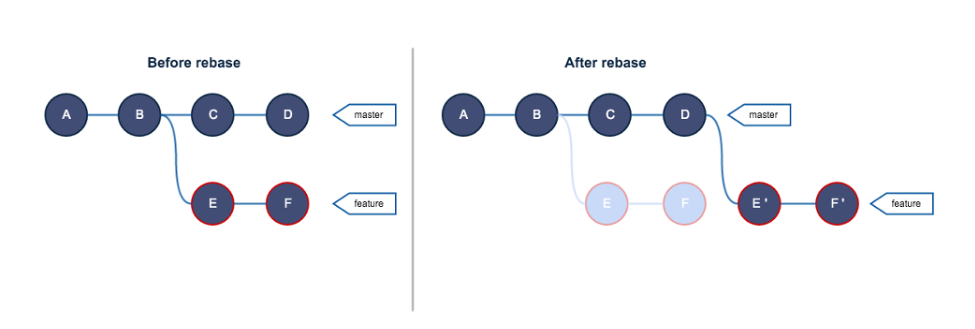
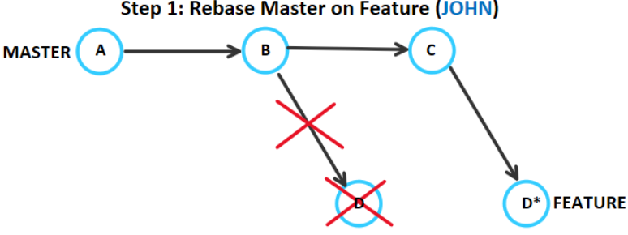
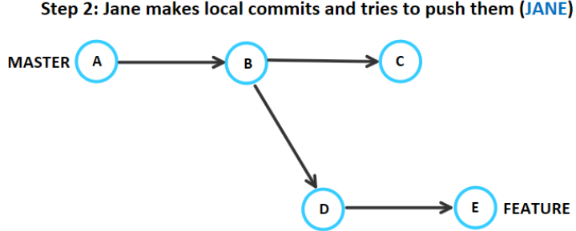
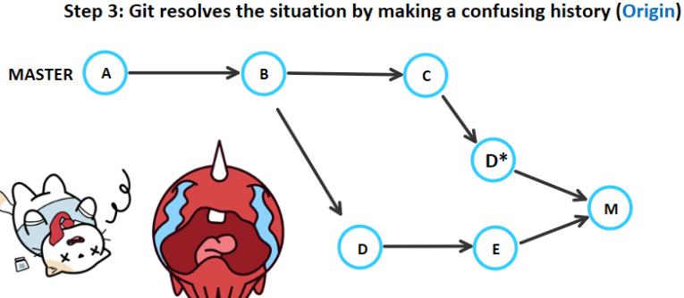
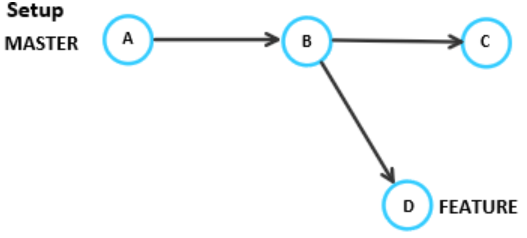
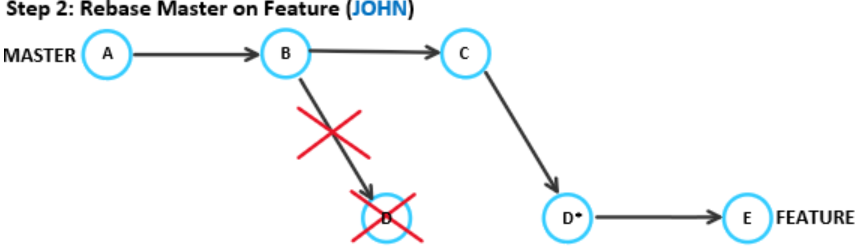
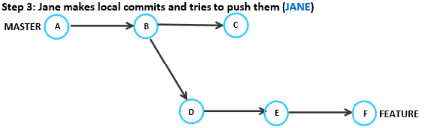
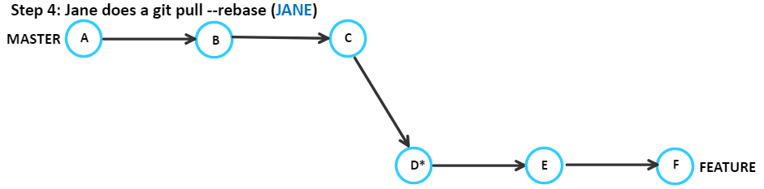
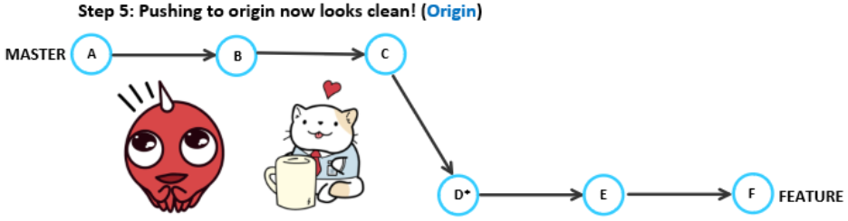
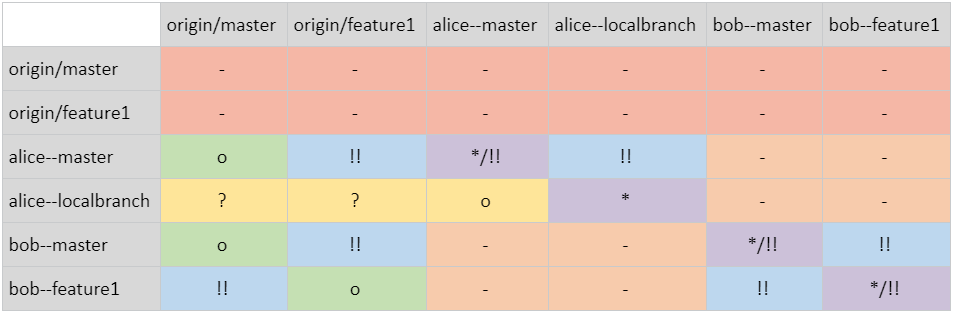

# Markdown Version

# Rebase Experiments:

# Notes on safely incorporating the benefits of git rebase for any team

##### Christina Tang

##### Benjamin Vinicky

##### _20 August 2018_

---

## _I. Introduction_

---

Teams should consider a workflow that suits their team size, history requirements, iteration length, etc.

1. **Merge.** Collaborators work in their respective local repositories. When it is time to push, they pull any of the new commits from remote origin (implicit new merge commit), and then push their changes onto the remote. The new merge commit may be very large.

2. **Rebase.** When it is time to push changes, the collaborator may interactively rebase local commits to clean up history. Then, they rebase local working branches onto the shared branch in order to get team commits downstream. This ensures the collaborator’s changes are clean commits on top of the history, and only results in fast-forward merges.

3. **Fork & Pull Request.** This is most common in large open-source projects. One person is assigned to maintain the repo, and only they can push to branches. Other collaborators can clone the repo, make changes, and then submit a pull request to the repo owner. The repo owner manages the added history.

Rebasing is more than a tool for “_cleaning a commit history._” It is very powerful when properly incorporated into a team’s workflow.

In the past, many people have rejected git rebase because of its power to erase history. The `$ git bisect` command will not accurately find bugs when the linearity of git history is broken, but that which can also be caused by too many merge commits. There are two main philosophies on keeping a git history:

- No-rebasers want a complete record of project history, including each contributor's history. No-rebasers believe git histories should show every bug fix, code redesign, false starts, and unnecessary commits.

- Yes-rebasers want a relevant history of the project. They believe history from individual contributors are irrelevant and can be distracting or counter-productive.

No-rebasers on large projects develop histories that are hard to read through. Without any rebasing, the history will have many extra commits and unavoidable merge commits.

The alternative is to incorporate rebase somewhere. People are hesitant because improper rebasing can lose work and lose history. However, when rebase is used deliberately, developers can still commit often, bisect for bugs, and avoid making lots of commits to the entire project history.

This report is a guide on how to decide where git rebase can be used, where problems can occur, and how to mitigate or fix potential rebase misuse problems.

---

## _II. Background_

---

This section explains git rebase and what it does to project history.

The diagram below shows what happens when you are in feature branch and rebase onto master (git rebase master).



Source: freecodecamp.org

Suppose you are working on the feature branch and your team has finalized additions to master. Rebasing will put your changes on top of master’s new commits, so you can get new additions or bug fixes in your work without creating superfluous merge commits. Notice master branch is unchanged after rebasing feature branch.

##### What actually happens during a rebase?

1. The differing commits from feature are stored in the stash
2. Copies of these commits are played on top of master. The copies represent the same changes, but have a different parent commit, and therefore have a different SHA1 tag
3. Master tag and branch are unchanged
4. Feature branch’s HEAD tag now refers to a copy of the most recent commit, but with a different SHA1 tag

---

## _III. Research & Hypothesis_

---

To discover the ways git rebase can ruin a repository, we first imagined all the ways git rebase could be used. See _Appendix Table I_.

In this nutshell example, there are three copies of the repository. The origin repo exists remotely on a host like GitHub. It has two branches: master and feature1. Alice and Bob have both cloned this repo and have done some work. Additionally, Alice has her own local branch.

##### Our observations include:

You cannot rebase branches as the origin
You cannot rebase a branch from your repo to a copy of that branch on someone else’s repo
Alice and Bob’s master branches can rebase with origin/master. This is recommended, as they will be able to grab commits from origin without producing merge commits. Bob’s feature1 branch can also rebase with origin’s feature1.
Alice’s localbranch can rebase with anything upstream, but it is not recommended to upstream past the branch it branched off from. If not used carefully, it may cause problems trying to incorporate the local commits back onto a shared branch.
In general, do not rebase shared branches.
You can rebase a branch with itself to edit its history interactively. Proceed cautiously. Pushing history changes can quickly cause problems for collaborators.

In general, people state a certain rule for beginners:

Never rebase upstream

When we change the history that other collaborators have also copied into their local repos, we make it difficult for anyone’s new changes to be added properly.

---

## _IV. Experiments_

---

### Experiment (1/2): Loss of history accuracy

John rebases Feature onto Master. Jane makes some local commits to feature.

In _Step 1_, John rebases and then force pushes to remote. If anyone else had pushed any changes to feature, they would have been overwritten by the force push.

The rebase also creates a new commit D, which has the same changes as D, but a different SHA1, because it references a different parent commit.



Jane tries to push her local commits, but gets an error. She needs to pull first.



Her feature branch has commits A-B-D-E, while John’s rebase of feature to be A-B-C-D\* is on origin. Jane’s pull creates an implicit merge commit M for these two versions of feature, without quite understanding what’s going on. Then she pushes the two histories of feature along with their resolution all onto the origin.



We have a confusing history with duplicate commits and unnecessary marges that may make it hard to track down bugs in the future.

---

### Experiment (2/2):

Using `$ git pull --rebase` to mitigate problems from upstream history changes






Potential loss of work: If John performed a rebase and force push without fetching and integrating Jane’s changes, he would have lost all of Jane’s work.







---

##### When should we use interactive rebase over merging.

You should use interactive rebasing when "fixing history" is the goal. You can change commit messages, and go back any length of commits to alter history.

##### Examples of how we can ruin our history with interactive.

It is possible to reset the head any number of commits with git rebase -i. If a user were to use a force push after doing so, a lot of history and work would be lost. It would still be possible to recover this lost history and work, but is very difficult to do.

##### When are force pushes appropriate?

Force pushes should only be used when the team is trained to constantly use `$ git pull –-rebase`. If possible, force pushes should be avoided. Where a force push is required, the team should be notified to use `$ git pull -–rebase` if not regularly doing so. It is easy to lose work and history when users use `$ git push –-force` with abandon.

---

## _V. General Lessons (Beginner)_

---

**_Do not rebase between shared branches_**

Editing the history of any shared branch will almost always cause problems for contributors.
When someone else pulls for the new history, git does a discrete merge for the remote and local histories. When they push, repeated merges end up in the remote history. From then on, any other contributor that pulls and pushes will be creating more discrete merge commits in the history.

Either way, attempts at pushing a new history on a shared branch will be warned by git, and they have to force a push to continue. Although still not best practice, using option `$ git push --force-with-lease` will check to see if other's work will be overwritten; if so, cancel the push.

Only rebase local branches or “downstream” cases
Safest rebase cases:
your local master with origin/master
your feature branch with the origin/feature branch
anything onto your local branch.

**_Only rebase downstream_**

The advantages of rebasing
It cleans history to be linear and easier-to-read. Interactive rebasing (-i) provides advanced commit history editing options: combine, split, rewrite, add, remove, and rearrange.

Amend commits much deeper than with the -–amend option.

The disadvantages of rebasing
History will not be completely accurate. Timestamps are distorted, which can cause problems retroactively looking for bugs. Rebasing shared branches, or upstream, can easily cause a catastrophic loss of work from collaborators.

Rebasing also takes space, because it creates copies of every commit on your branch before running the changes on top of the new base.

---

## _VI. Further Reading (Advanced)_

---

##### Using Git Pull Rebase

Small or coordinated teams can safely rebase shared branches. This breaks the golden rule people have set for beginners, but has benefits.

If someone has forced pushed upstream changes, make sure everyone in the team is using either

```
$ git pull --rebase
$ git fetch & git rebase
```

And the team will make sure they are always working with the most recent history, even if the branch still looks like it is the same

Quick Tip:
You can always do a `$ git pull --rebase` with this configuration:
`$ git config --global pull.rebase true`

##### Can you truly lose work?

The .git/logs/refs folder has the SHA1 for every commit, including the commit made before a disaster had occurred. Git does not readily delete commits from your database, so losing work just means the commit with lost work is no longer being referenced by a tag (branch) or another commit. If you can find the SHA1, you can make a temporary branch to your work and recover it.

##### Can you truly mess up history?

When force push changes history upstream, there is evidence that every repo problem can be solved by other collaborators using `$ git pull --rebase`[3](.

---

## _VII. References_

---

Redfin Engineering, “Git Rebasing Public Branches Works Much Better Than You'd Think.” _Code Red_, 4 Oct. 2017, [redfin.engineering/git-rebasing-public-branches-works-much-better-than-youd-think-ecc9a115aea9](https://www.redfin.engineering/git-rebasing-public-branches-works-much-better-than-youd-think-ecc9a115aea9).

DeVore, Greg. “Recovering From a Disasterous Git-Rebase Mistake.” _The ScreenSteps Blog for Employee Training_, blog.screensteps.com/recovering-from-a-disastrous-git-rebase-mistake.

Musseau, Julius. “Too Much Fun with ‘Git Pull --Rebase.’” _Doing Git Wrong_, mergebase.com/doing-git-wrong/2018/03/07/fun-with-git-pull-rebase/.

“Git Rebase and the Golden Rule Explained. – FreeCodeCamp.” _FreeCodeCamp_, 28 Feb. 2016, medium.freecodecamp.org/git-rebase-and-the-golden-rule-explained-70715eccc372.

---

## _VIII. Appendix_

---

**Table 1**. _Core rebase combinations and their safeties_
-Table filled for the case to “_rebase row onto column_”



Legend:
[o] generally safe  
[?] questionable
[!!] danger
[-] impossible
[*] interactive rebasing
