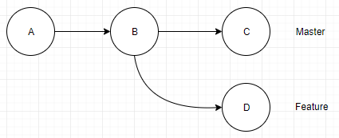
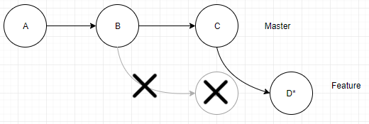
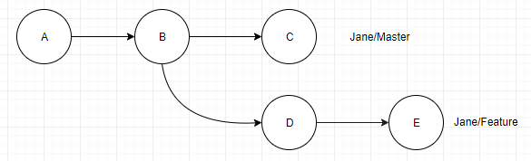
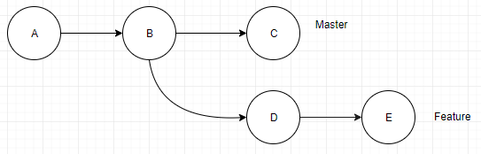
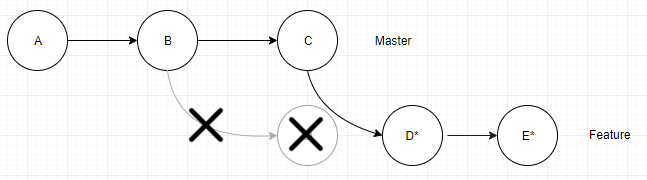
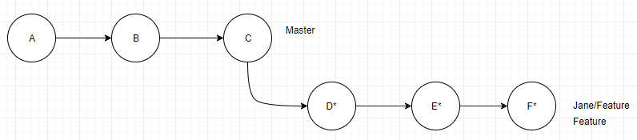

[comment]: <> (Markdown version)

# Rebase Experiments:

# Notes on safely incorporating benefits of git rebase for any team

##### Christina Tang
##### Benjamin Vinicky

##### _29 August 2018_

---

## _I. Purpose_

---

This document is for anyone interested in using git rebase to improving productivity or project history clarity.

This report will answer:
- why rebase is useful
- what git rebase does
- when rebase can be used
- where rebase problems can occur
- how to fix or mitigate rebase problems

---

## _II. Introduction_

---

####What is Rebase?
Git Rebase is a tool used to integrate changes while sustaining manageable, clean histories. Rebase rewrites git history by taking commits, stashing them, making new identical commits, and playing them on the head of the specified branch. This produces a much cleaner history, but comes with inherent risks if inappropriately used. 

Although `$ git merge` is used in a similar fashion as `$ git rebase` it's important to note that they are very different. Rebase can be a very useful tool to maintain a clean history, but there are inherent risks that users need to be familiar with.
####History
 
 Opinions on using rebase tend to be varied and extreme due to the inherent riks 

There are two main philosophies on keeping a git history:

- **_Anti-rebasers_** want a complete record of project history, including each contributor's history. They believe git histories should show every bug fix, code redesign, false starts, and unnecessary commits.

- **_Pro-rebasers_** want a relevant record of project history. They believe history from individual contributors are irrelevant and can be distracting or counter-productive.

Many teams prefer a history in between, so understanding how to rebase safely is important. 

People tend to avoid rebase, because misuse can lose work, lose history, or create confusing history with duplicate commits. Timestamps are distorted, which can cause problems with retroactively looking for bugs. Ultimately, the history is more of a relevant picture rather than a complete one. 

However, never rebasing will create project histories that are hard to read. Never rebasing creates too many unnecessary commits and unavoidable merge commits.

The alternative is to incorperate rebase. Some teams only ever use rebase, while other teams choose to rebase for a subset of scenarios. When rebase is used appropriately, developers can still commit often, [bisect](https://linuxhint.com/git-bisect-tutorial/) for bugs, all while avoiding lots of merge commits to the entire project history.

Rebasing is more than a tool for “_cleaning a commit history._” It is powerful when properly incorporated into a team’s regular [workflow](https://www.atlassian.com/git/tutorials/comparing-workflows).


---

## _III. How It Works_

---
In this section we will take a look at git rebase, what it does to project history, and when it can be used. 

##### Rebase vs Merge

For now, consider the simple case of syncing changes between master and a feature branch. 

Terminology: (1) the branch *being rebased*, and (2) the branch we are *rebasing onto*.

```
(In your console)
~/Git/GitExample (feature) <--This is the branch being rebased (1)
$ git rebase master <-- We are rebasing onto Master (2)
```

The diagram below shows what happens when you are *rebasing feature onto master* (`$ git rebase master`).

To convince yourself, notice how feature has a "new base" on top of "where master is."


Source: freecodecamp.org

Suppose you are working on the feature branch and your team has finalized additions to master. Rebasing will put your changes on top of master’s new commits. You can get newer, finalized additions or bug fixes in your work, without creating extra merge commits. 

Note master branch is unchanged here. When we rebase feature, only feature is changed.

When you decide you want master to incorperate the feature branch, and you rebased feature onto master's new changes, merging with master will result in a *fast-forward merge.*

##### What actually happens during a rebase?

1. The differing commits from feature are stored in the stash
2. Copies of these commits are played on top of master. The copies represent the same changes, but have a different parent commit, and therefore have a different SHA1 ref
3. Feature branch’s HEAD tag now refers to a copy of the most recent commit, but with a different SHA1 ref

Note that rebasing uses space as it creates copies of every commit on your branch before running the changes on top of the new base. 

##### Where should rebase be used in a collaborative workflow?

Above, we discussed what would happen if you rebased a branch within your local repository. 
```
~/Git/GitExample (master) <-- rebasing
$ git rebase feature  <-- onto
```


You can also rebase master onto origin/master or feature onto origin/feature. This is great for updating your work before publishing your changes to the rest of the team. 

\*\**__However, you should never reverse the direction: "upstream!"__*\*\*

Do not rebase master onto feature (if feature is branched from master), origin/master onto master, or origin/feature onto feature.

If you aren't careful about not rebasing shared branches or upstream, **you can cause your team to lose work.** Think carefully: if you rebase a shared branch onto your changes, you are inserting your commits into a history that other people need to share. You will break history for other collaborators if you push this change. When they attempt to sync their changes with origin, they will be very confused.  

When we change the history that other collaborators have also copied into their local repos, we make it difficult for anyone’s new changes to be added properly.

_Rebasing upstream is dangerous in most situations and should only be attempted by a small team of git "experts"._

If you submit a **pull request**, do not rebase the branch. After a pull request, the branch is considered public. 

In general, **do not rebase shared branches** but you should rebase *onto* shared branches.

##### Git Pull --Rebase

A git pull works by fetching and then merging. Similarly a `$ git pull --rebase` first fetches the branch, and then does a rebase. While `$ git pull --rebase` seems the same as git fetch and git rebase,
it is important to know that they are not the same. The pull rebase option looks in the reflogs of the remote tracking branch and can tell which commits are local, and which are from an earlier fetch. The result is a linear, readable history with all work intact and in order. _Magic_.

##### Conflicts

History conflicts happen when someone else has pushed commits to origin. You need to get the new commits AND decide what to do what to do with them. Without rebase, you had `$ git pull` or `$ git fetch` + `$ git merge`. Both create implicit merge commits. Rebase provides greater control and flexibility when you want to sync a branch to origin. Here are your rebase options:

- git pull --rebase
- git fetch; git rebase

 Once your local git history matches origin, but with your changes applied on top, you can safely push to origin.

**Merge conflicts** still can happen using rebase. Fix and continue as usual.

___

## _IV. Experiments_

___

### Experiment (1/2): Loss of history accuracy

Consider this common workplace scenario...

John and Jane are working from a repository below. They have just cloned this from origin, and are now collaborating on the feature branch.



___

**Step 1:**

John decides to rebase the feature branch to get master's latest commit. 
This is going to cause problems because feature is a shared branch. 
Git complains when John tries to push, but John decides to force push to origin anyways. 
```
Johns ~/Git/GitExample (feature)
$ git rebase master
$ git push --force
```


**Result:** Johns commit 'D' has been moved to the stack and duplicated to D* which has a new SHA1. This new commit has been played on top of the head of Master. After John force pushes, origin now has the same history as John.

___

**Step 2:**
Jane has just commited her work in feature and now wants to push it to origin. 


```
Jane ~/Git/GitExample (feature)
$ git push origin/feature
... ![rejected]...
error: failed to push some refs to...
hint: Updates were rejected because the tip of your current branch is behind its remote counterpart. 
hint: Integrate the remote changes (e.g. 'git pull...')...
```
Jane doesn't know that John has rebased feature. She knows her history is "behind," so she pulls. 

```
Jane ~/Git/GitExample (feature)
$ git pull
```

**Result:**  This produced an error when trying to push. When Jane pulls, git tries to correct this error resulting in an implicit merge with duplicate commits and abundant headaches. 

Jane's feature branch commits :    A-B-D-E
John’s rebase and origin commits:  A-B-C-D\*

This is what the history looks like if Jane had used fetch instead of pull:


___
**Step 3:** As Jane pulls, Git resolves the pull the only way it can. An implicit merge commit is created. 

Jane only knows that she pulled changes and updated the branch. 
These are harmless tasks, so she pushes and shares it with her collaborators.


**Final Result:** We have a confusing history with duplicate commits, extra branch in the history, and unnecessary merges that may make it hard to track down bugs in the future.  This is a problem for everyone. 

If Jane had used `$ git pull --rebase` instead of `$ git pull`, this is the history she would have created and pushed instead: 


---

### Experiment (2/2):
**Enter the magic of `git pull --rebase`**

Using the same setup as Experiment 1, we use `$ git pull --rebase` to mitigate problems from upstream history changes in a slightly different scenario.


**Step 1:** This time Jane starts off by pushing her work, commit 'E' to origin first. Then she pushes.

```
JanesAccount ~/Git/GitExample (feature)
$ git push origin/feature
```



**Result:** A successful push to origin! John/Feature still references D, as shown in setup.
___

**Step 2:** John wants to rebase his local feature on master. Since John is on a shared branch he does a pull first, then rebases feature onto master to update feature with master's commit C.
```
JohnsAccount ~/Git/GitExample (feature)
$ git pull
...
[success]

JohnsAccount ~/Git/GitExample (feature)
$ git rebase master
```


**Result:** John has pulled Jane's work successfully and rebased to master. The history is clean and concise and no work is lost.

**_Potential loss of work!!!_** In this experiment, Jane pushed a commit first. If John performs a rebase and force pushes (like in experiment 1) without fetching and integrating Jane's changes, he would have overwritten & lost all of Jane’s work.
ie: `$ git pull --rebase` or `$ git fetch & git rebase`

___

**Step 3:** Jane makes another commit on her local machine.
```
JanesAccount ~/Git/GitExample (feature)
$ git push origin/feature
```

**Result:** Another successful commit!

___

**Step4:** Jane wants to push her changes to origin.
```
JanesAccount ~/Git/GitExample (feature)
$ git push origin/feature
... ![rejected]...
error: failed to push some refs to...
hint: Updates were rejected because the tip of your current branch is behind its remote counterpart. 
hint: Integrate the remote changes (e.g. 'git pull...')...
```
It complains because John rebased master and pushed that to origin. 

Jane's feature branch commits :    A-B-D-E-F
John’s rebase and origin commits:  A-B-C-D*-E*

Jane does a pull rebase, instead of a pull, to incorperate his changes with hers safely. 
```
JanesAccount ~/Git/GitExample (feature)
$ git pull --rebase
...[success]
```


Now she can safely push to origin. 
```
JanesAccount ~/Git/GitExample (feature)
$ git push origin/feature
...[success]
```
**Result:** A beautiful history with no work lost and happy collaborators!
___

## V. General Lessons (Beginner)

___

\*\***_Do not rebase between shared branches_**\*\*

Editing the history of any shared branch will almost always cause problems for contributors. Always put your changes on top.

Consider the scenario where someone rebases a shared branch. When someone else pulls for the new history, git does a discrete merge for the remote and local histories. When they push, repeated merges end up in the remote history. From then on, any other contributor that pulls and pushes will be creating more discrete merge commits in the history.

_When history has been altered on a shared branch,_ `$ git pull --rebase` _can be used in place of git pull to resolve conflicts of history and avoid extra merge commits_.

Attempts at pushing a new history on a shared branch will be warned by git, and require a force push to continue. Although not best practice, using option `$ git push --force-with-lease` will check to see if other's work will be overwritten; if so, cancel the push and `$ git pull --rebase` before pushing again.

\*\***_Only rebase local branches or “downstream” cases_**\*\*

_Safest rebase cases:_

- your master _onto_ origin/master
- your feature _onto_ origin/feature
- your local branch _onto_ its parent branch

---

## VI. Advanced Notes

---

##### Git Pull Rebase

Small or coordinated teams can safely rebase shared branches. This breaks the golden rule people have set for beginners, but has benefits.

If someone has force pushed upstream changes, make sure everyone in the team is using either

```
$ git pull --rebase
$ git fetch & git rebase
```

And the team will make sure they are always working with the most recent history, even if the branch still looks like it is the same

Quick Tip:
You can always do a --rebase pull everytime you `$ git pull` with this configuration:
`$ git config --global pull.rebase true`

##### Interactive rebase

Interactive rebasing (-i) provides advanced [commit history editing options](https://robots.thoughtbot.com/git-interactive-rebase-squash-amend-rewriting-history#interactive-rebase): combine, split, rewrite, add, remove, and rearrange. If needed, it is possible to use this for local cleanup, but you should never be rebasing shared commits.

##### When are force pushes appropriate?

Force pushes should only be used when the team is trained to constantly use `$ git pull –-rebase`. If possible, force pushes should be avoided. Where a force push is required, the team should be notified to use `$ git pull -–rebase` if not regularly doing so. It is easy to lose work and history when users use `$ git push –-force` with abandon.

##### Can you truly mess up history?

When force push changes history upstream, there is evidence that every repo problem can be solved by other collaborators using `$ git pull --rebase`

##### Can you truly lose work?

The .git/logs/refs folder has the SHA1 for every commit, including the commit made before a disaster had occurred. Git does not readily delete commits from your database, so losing work just means the commit with lost work is no longer being referenced by a tag (branch) or another commit. If you can find the SHA1, you can make a temporary branch to your work and recover it.

___

## _VIII. Summary/Takeaways_

___

- Git works by taking commits, stashing them, assigning new sha1s, and playing them on the head of the specified branch.
- Never rebase upstream (Unless you're 100% confident your entire team will never make a mistake...)
- Never rebase shared branches
- Never rebase pull requests
- Use `$ git pull --rebase` whenever applicable
- ALWAYS `$ git pull --rebase` before rebasing
- Remember to use `$ git push --force-with-lease` in place of `$ git push --force`
- You can use `$ git config --global pull.rebase true` to rebase pull by default
- Although work can be recovered, your relationship with your co-workers may be permantly damaged. Use rebase with caution.


___

## _IX. Git Commands Reference_

___

**Rebase:**
-`$ git rebase <"onto" branch>`

-[Interactive option](https://robots.thoughtbot.com/git-interactive-rebase-squash-amend-rewriting-history): (For Advanced Users)
`$ git rebase --interactive`   or `-i` 

-arguments in interactive mode:
`p, pick <sha1>` use specified commit
`r, reword <sha1>` use commit, and edit commit message
`e, edit <sha1>` = use commit, but stop for amending`
`s, squash <sha1>` = use commit, but meld into previous commit`
`f, fixup <sha1>` = like "squash", but discard this commit's log message`
`x, exec` = run command (the rest of the line) using shell`

**Pulling With Rebase:**
`$ git pull --rebase` or `-r`
`$ git fetch & git rebase`

-Setting up config for automatic rebase pulling:
`$ git config --global pull.rebase true`

**Pushing With Rebase:**
`$ git push --force`

-Check to see if work will be overwritten first:
`$ git push --force-with-lease`

___

## X. References

___

Redfin Engineering, “Git Rebasing Public Branches Works Much Better Than You'd Think.” _Code Red_, 4 Oct. 2017, [redfin.engineering/git-rebasing-public-branches-works-much-better-than-youd-think-ecc9a115aea9](https://www.redfin.engineering/git-rebasing-public-branches-works-much-better-than-youd-think-ecc9a115aea9).

DeVore, Greg. “Recovering From a Disasterous Git-Rebase Mistake.” _The ScreenSteps Blog for Employee Training_, [blog.screensteps.com/recovering-from-a-disastrous-git-rebase-mistake](https://blog.screensteps.com/recovering-from-a-disastrous-git-rebase-mistake).

Musseau, Julius. “Too Much Fun with ‘Git Pull --Rebase.’” _Doing Git Wrong_, [mergebase.com/doing-git-wrong/2018/03/07/fun-with-git-pull-rebase/](https://mergebase.com/doing-git-wrong/2018/03/07/fun-with-git-pull-rebase/).

“Git Rebase and the Golden Rule Explained. – FreeCodeCamp.” _FreeCodeCamp_, 28 Feb. 2016, [medium.freecodecamp.org/git-rebase-and-the-golden-rule-explained-70715eccc372](https://medium.freecodecamp.org/git-rebase-and-the-golden-rule-explained-70715eccc372).