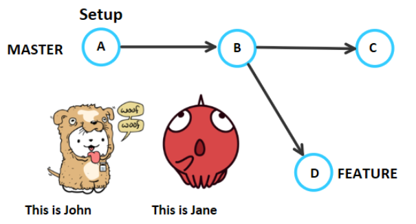
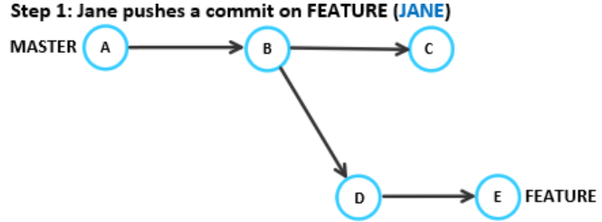
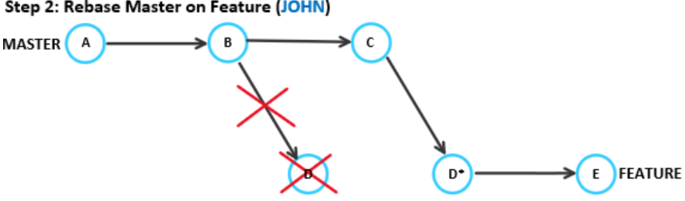
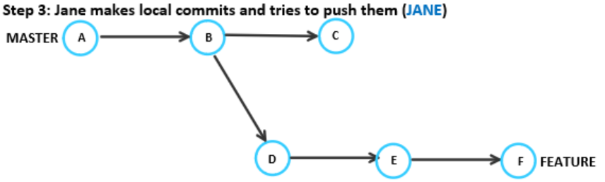
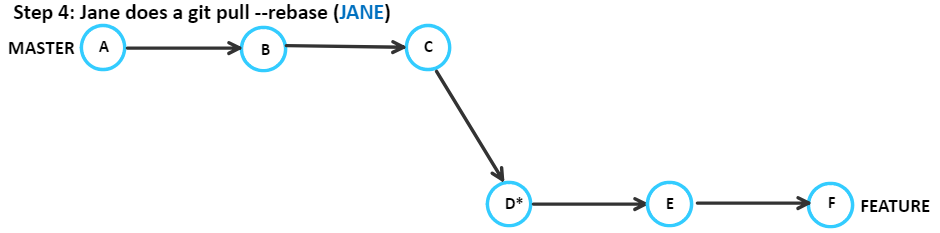
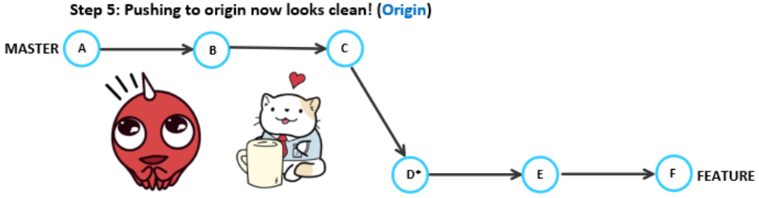

[comment]: <> (Markdown version)

# Rebase Experiments:

# Notes on safely incorporating benefits of git rebase for any team

##### Christina Tang
##### Benjamin Vinicky

##### _29 August 2018_

---

## _I. Purpose_

---

This document is for anyone interested in using git rebase to improving productivity or project history clarity.

This report will answer:
- why rebase is useful
- what git rebase does
- when rebase can be used
- where rebase problems can occur
- how to fix or mitigate rebase problems

---

## _II. Introduction_

---

`$ git rebase` solves the same problem as `$ git merge` to integrate changes, but git history is affected very differently. 

There are two main philosophies on keeping a git history:

- **_Anti-rebasers_** want a complete record of project history, including each contributor's history. They believe git histories should show every bug fix, code redesign, false starts, and unnecessary commits.

- **_Pro-rebasers_** want a relevant record of project history. They believe history from individual contributors are irrelevant and can be distracting or counter-productive.

Your team most likely wants a history in between, so understanding how to rebase safely is important.

People tend to avoid rebase, because misuse can lose work or lose history. However, never rebasing will create project histories that are hard to read. Never rebasing creates too many unnecessary commits and unavoidable merge commits.

The alternative is to incorperate rebase. Some teams never merge and only rebase, while other teams choose to rebase for a subset of scenarios. When rebase is used appropriately, developers can still commit often, bisect for bugs, all while avoiding lots of merge commits to the entire project history. 

Rebasing is more than a tool for “_cleaning a commit history._” It is powerful when properly incorporated into a team’s regular [git workflow](https://www.atlassian.com/git/tutorials/comparing-workflows).


##### The disadvantages of rebasing

History will not be completely accurate. Timestamps are distorted, which can cause problems retroactively looking for bugs. 

---

## _III. Background_

---
This section explains git rebase, what it does to project history, and when it can be used. 

##### Rebase vs Merge

For now, let's consider the simple case of syncing changes between master and a feature branch. 

Terminology: (1) the branch *being rebased*, and (2) the branch we are *rebasing onto*.

The diagram below shows what happens when you are *rebasing feature onto master* (`$ git rebase master`).

To convince yourself, notice how feature has a "new base" on top of "where master is."


Source: freecodecamp.org

Suppose you are working on the feature branch and your team has finalized additions to master. Rebasing will put your changes on top of master’s new commits, so you can get new additions or bug fixes in your work without creating extra merge commits. 

Note master branch is unchanged here. When we rebase feature, only feature is changed.

##### What actually happens during a rebase?

1. The differing commits from feature are stored in the stash
2. Copies of these commits are played on top of master. The copies represent the same changes, but have a different parent commit, and therefore have a different SHA1 tag
3. Feature branch’s HEAD tag now refers to a copy of the most recent commit, but with a different SHA1 tag

##### Where should rebase be used in a collaborative workflow?

Above, discussed what would happen if you rebased a branch within your local repository. 

You can also rebase between master onto origin/master or feature onto origin/feature. This is great for updating your work before publishing your changes to the rest of the team. 

However, *__you should never reverse the direction "upstream!"__*

If you are not careful about not rebasing shared branches, or upstream, **you can cause your team to lose work.** Think carefully: if your rebase command rebases a shared branch onto your changes, you are inserting your commits into a history that other people need to share. You will break history for other collaborators if you push this change. When they attempt to sync their changes with origin, they will be very confused. 

In general, **do not rebase shared branches.**

When we change the history that other collaborators have also copied into their local repos, we make it difficult for anyone’s new changes to be added properly.

##### Conflicts

History conflicts happen when your someone else has pushed commits to origin. You need to get the new commits AND decide what to do what to do with them. Without rebase, you had `$ git pull` or `$ git fetch` + `$ git merge`. Both create implicit merge commits. Rebase provides greater control and flexibility when you want to sync a branch to origin. Here are the options:

- git pull
- git pull --rebase
- git fetch; git merge
- git fetch; git rebase

 Once your local git history matches origin, but with your changes applied on top, you can safely push to origin.

**Merge conflicts** still can happen using rebase. Fix and continue as usual.


---

## _IV. Experiments_

---

### Experiment (1/2): Loss of history accuracy

Consider this common workplace scenario.

John rebases Feature onto Master. Jane makes some local commits to feature.

In _Step 1_, John rebases and then force pushes to remote. If anyone else had pushed any changes to feature, they would have been overwritten by the force push.

The rebase also creates a new commit D, which has the same changes as D, but a different SHA1, because it references a different parent commit.


Jane tries to push her local commits, but gets an error. She needs to pull first.


Her feature branch has commits A-B-D-E, while John’s rebase of feature to be A-B-C-D\* is on origin. Jane’s pull creates an implicit merge commit M for these two versions of feature, without quite understanding what’s going on. Then she pushes the two histories of feature along with their resolution all onto the origin.


We have a confusing history with duplicate commits and unnecessary marges that may make it hard to track down bugs in the future.

---

### Experiment (2/2):

Using `$ git pull --rebase` to mitigate problems from upstream history changes






**_Potential loss of work!!!_** If John performed a rebase and force pushes without fetching and integrating Jane’s changes, he would have lost all of Jane’s work.
ie: `$ git pull --rebase` or `$ git fetch & git rebase`








---

## V. General Lessons (Beginner)

---

**_Do not rebase between shared branches_**

Editing the history of any shared branch will almost always cause problems for contributors.
When someone else pulls for the new history, git does a discrete merge for the remote and local histories. When they push, repeated merges end up in the remote history. From then on, any other contributor that pulls and pushes will be creating more discrete merge commits in the history.

_When history has been altered on a shared branch,_ `$ git pull --rebase` _can be used in place of git pull to resolve conflicts of history and avoid extra merge commits_.

Attempts at pushing a new history on a shared branch will be warned by git, and require a forced push to continue. Although not best practice, using option `$ git push --force-with-lease` will check to see if other's work will be overwritten; if so, cancel the push and `$ git pull --rebase` before pushing again.

**_Only rebase local branches or “downstream” cases_**

_Safest rebase cases:_

- your local master with origin/master
- your feature branch with the origin/feature branch
- anything onto your local branch.

**_Only rebase downstream_**

Rebasing uses space as it creates copies of every commit on your branch before running the changes on top of the new base.

---

## VI. Advanced Notes

---

##### Git Pull Rebase

Small or coordinated teams can safely rebase shared branches. This breaks the golden rule people have set for beginners, but has benefits.

If someone has forced pushed upstream changes, make sure everyone in the team is using either

```
$ git pull --rebase
$ git fetch & git rebase
```

And the team will make sure they are always working with the most recent history, even if the branch still looks like it is the same

Quick Tip:
You can always do a `$ git pull --rebase` with this configuration:
`$ git config --global pull.rebase true`

Setting the config is recommended and powerful, but then, it's important to never pull or rebase master.

##### Interactive rebase

Interactive rebasing (-i) provides advanced commit history editing options: combine, split, rewrite, add, remove, and rearrange.

##### When are force pushes appropriate?

Force pushes should only be used when the team is trained to constantly use `$ git pull –-rebase`. If possible, force pushes should be avoided. Where a force push is required, the team should be notified to use `$ git pull -–rebase` if not regularly doing so. It is easy to lose work and history when users use `$ git push –-force` with abandon.

##### Can you truly lose work?

The .git/logs/refs folder has the SHA1 for every commit, including the commit made before a disaster had occurred. Git does not readily delete commits from your database, so losing work just means the commit with lost work is no longer being referenced by a tag (branch) or another commit. If you can find the SHA1, you can make a temporary branch to your work and recover it.

##### Can you truly mess up history?

When force push changes history upstream, there is evidence that every repo problem can be solved by other collaborators using `$ git pull --rebase`

---

## VII. References

---

Redfin Engineering, “Git Rebasing Public Branches Works Much Better Than You'd Think.” _Code Red_, 4 Oct. 2017, [redfin.engineering/git-rebasing-public-branches-works-much-better-than-youd-think-ecc9a115aea9](https://www.redfin.engineering/git-rebasing-public-branches-works-much-better-than-youd-think-ecc9a115aea9).

DeVore, Greg. “Recovering From a Disasterous Git-Rebase Mistake.” _The ScreenSteps Blog for Employee Training_, [blog.screensteps.com/recovering-from-a-disastrous-git-rebase-mistake](https://blog.screensteps.com/recovering-from-a-disastrous-git-rebase-mistake).

Musseau, Julius. “Too Much Fun with ‘Git Pull --Rebase.’” _Doing Git Wrong_, [mergebase.com/doing-git-wrong/2018/03/07/fun-with-git-pull-rebase/](https://mergebase.com/doing-git-wrong/2018/03/07/fun-with-git-pull-rebase/).

“Git Rebase and the Golden Rule Explained. – FreeCodeCamp.” _FreeCodeCamp_, 28 Feb. 2016, [medium.freecodecamp.org/git-rebase-and-the-golden-rule-explained-70715eccc372](https://medium.freecodecamp.org/git-rebase-and-the-golden-rule-explained-70715eccc372).
